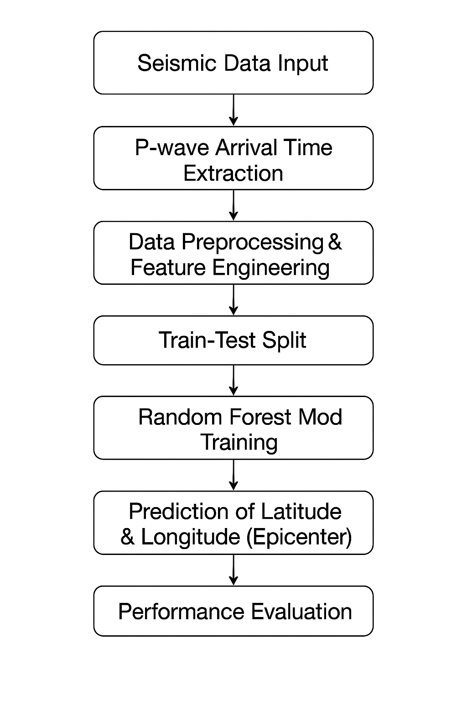
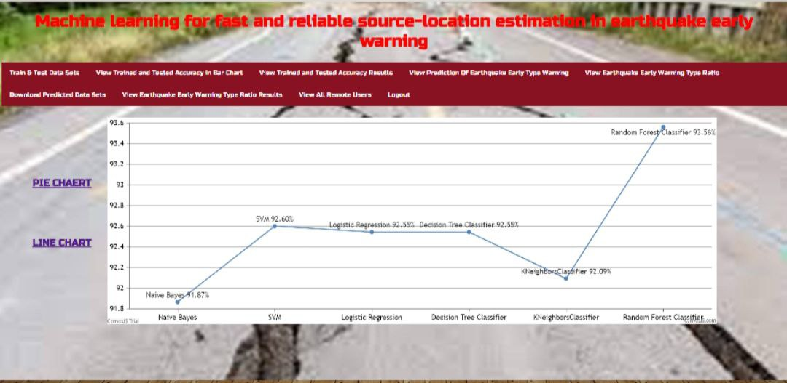

# 🌋 Estimation of Earthquake Early Warning

### 🎯 Overview
The **Estimation of Earthquake Early Warning** project aims to locate earthquakes in real time using **machine learning** techniques.  
The system utilizes **P-wave arrival time differences** and **seismic station locations** to estimate the earthquake’s epicenter effectively.

---

### ⚙️ Tech Stack
- **Programming Language:** Python  
- **Libraries/Tools:** Scikit-learn, NumPy, Pandas, Matplotlib  
- **Algorithm Used:** Random Forest Regression  
- **Dataset Source:** Japanese Seismic Data Repository  

---

### 🧠 Methodology
1. Extracted all seismic events having at least five P-wave arrival times from nearby seismic stations.  
2. Split the data into **training** and **testing** sets.  
3. Trained a **Random Forest model** to predict the latitude and longitude of earthquake epicenters.  
4. Evaluated model performance using regression accuracy metrics.  

---

### 📊 Results & Conclusion
The model successfully demonstrates the capability to:
- Locate earthquakes in **real-time** with high accuracy.  
- Perform effectively even when trained using **only three seismic stations** and **70% of available data**.  
- Exhibit strong flexibility for real-time earthquake monitoring in challenging regions.  

> Despite limited seismic station distribution in some areas, the approach remains robust by generating **synthetic datasets** to enhance model generalization and coverage.

---

### 🚀 Future Scope
- Implement deep learning models (e.g., CNN, LSTM) for better prediction accuracy.  
- Extend model applicability to other global seismic regions.  
- Develop a real-time dashboard for visualization of earthquake predictions.

---

### 📸 Project Preview

## Workflow Diagram

## Output Snapshot

---

### 🧾 License
This project is developed as part of a **B.Tech Mini Project** for academic purposes.  
Feel free to fork and explore for learning or research!

---

